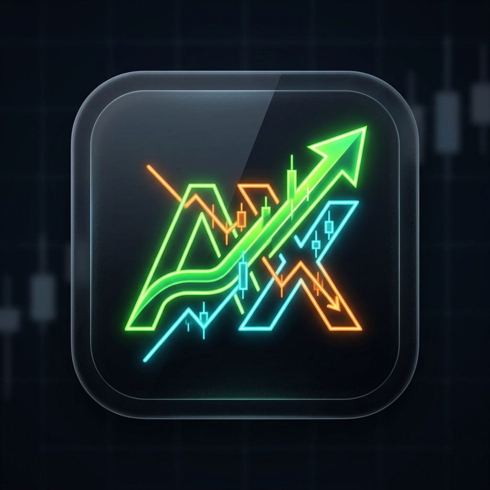

<div align="center">
  
  
  # Apex Trading
  
  **Real-Time Equities & Derivatives Paper Trading Terminal**  
  *Live Indian (NSE/BSE) & Global US Market Execution • TradingView-Grade Charts • Cloudflare D1 Sync*

  [](https://react.dev)
  [](https://vitejs.dev)
  [](https://nodejs.org)
  [](https://developers.cloudflare.com/d1/)
  [](https://developers.google.com/identity)
  [](LICENSE)

</div>

---

## 📌 Overview

**Apex Trading** is an institutional-grade paper trading web terminal built for active equity and options traders. It mirrors the speed, ergonomics, and precision of professional trading platforms (such as Zerodha Kite, Groww, and TradingView) with 100% genuine exchange data feeds, comprehensive order execution modeling, and cryptographic session security.

---

## ✨ Key Features

### 1. 📈 TradingView-Grade Candlestick Charts
- **Full Intraday Minute Intervals**: Switch seamlessly between **`1m`**, **`5m`**, **`15m`**, **`30m`**, **`1h`**, **`1D`**, **`1W`**, and **`1M`** candles.
- **Institutional Technical Overlays**: Built-in toggleable **EMA 20** (Cyan), **EMA 50** (Amber), and **Volume Histograms** with color-coded bull/bear pressure.
- **Real-Time Crosshair & Tooltips**: Inspect High, Low, Open, Close, Volume, and precise timestamp down to the minute.

### 2. ⚡ Real-Time Market Hours & IST Engine
- **Indian Equities (NSE/BSE)**: Tracks Monday through Friday **9:15 AM – 3:30 PM IST**. Displays real-time `NSE LIVE` or `NSE CLOSED` badges with tooltips.
- **US Equities (NYSE/NASDAQ)**: Built-in US Daylight Saving Time (DST) calculator:
  - **DST (March – November)**: Active trading from **7:00 PM to 1:30 AM IST**.
  - **Standard Time (November – March)**: Active trading from **8:00 PM to 2:30 AM IST**.
- **Accurate Exchange Quotes**: Matches official regular market price, absolute change, and percentage changes down to the exact decimal (e.g. NIFTY 50 `-41.00 (-0.17%)`).

### 3. 🛡️ Enterprise Anti-Session-Hijacking Defense
- **Device & Network Fingerprinting**: Every authenticated session is bound using HMAC-SHA256 over the client IP address and User-Agent signature.
- **Instant Hijack Revocation**: If an attacker intercepts a session cookie and attempts access from a different device or network, the session is immediately revoked, purged from Cloudflare D1, and rejected with `401 Unauthorized`.
- **`HttpOnly` Cookie Isolation**: Client JavaScript has zero access to session tokens, preventing XSS-based token theft.
- **Hardened Security Headers**: Integrated Helmet protection (anti-clickjacking, strict MIME enforcement, HSTS) and Express Rate Limiting.

### 4. ☁️ Multi-Tenant Cloudflare D1 Database
- **Dedicated User Spaces**: Each trader authenticated via Google OAuth 2.0 gets an isolated row in Cloudflare D1 (`axtrade-db`).
- **Persistent Cloud Sync**: Watchlists, trade journals, executed orders, and cash balances persist securely across devices.
- **Live Sync Indicator**: Visual online indicator in the navbar confirms continuous state synchronization with the database.

### 5. 🚀 24/7 Zero-Cost Crash Prevention
Engineered to run full-time on free-tier infrastructure without dropping connections or exceeding API thresholds:
- **Visible-Only Polling**: Background network requests pause immediately whenever the browser tab is minimized or hidden (`document.hidden`).
- **Pause on Market Close**: Polling automatically halts when trading sessions are closed; static numbers are never polled in endless loops.
- **Static Metadata Caching**: Company names, sectors, exchanges, and 52-week price extremes are cached long-term in memory, querying only dynamic ticks.

### 6. 📱 Universal Mobile Web App (PWA)
- Fully responsive design engineered for all smartphones, tablets, and desktop displays.
- Compliant with universal W3C web app specifications (`mobile-web-app-capable`) for Chrome, Safari, Firefox, and Edge.

---

## 🛠️ Tech Stack

- **Frontend**: React 18, Vite 8, Lightweight Charts v5, Lucide Icons, Canvas Confetti
- **Backend API**: Node.js, Express, Axios, Helmet, Cookie-Parser, Express-Rate-Limit
- **Database**: Cloudflare D1 Serverless SQL Database (`axtrade-db`)
- **Authentication**: Official Google Identity Services (OAuth 2.0)
- **Market Data**: Real-time multi-host v8 exchange charts & live ticker feeds

---

## 📂 Project Structure

```
Apex-Trading/
├── public/
│   ├── logo.png                # Brand emblem
│   ├── manifest.json           # Universal PWA manifest
│   └── sw.js                   # Service worker
├── server/
│   ├── data/
│   │   └── indianStocks.json   # Master exchange ticker catalog
│   ├── services/
│   │   ├── authService.js      # Google OAuth token verification
│   │   ├── d1Client.js         # Cloudflare D1 query & sync engine
│   │   ├── marketData.js       # Real exchange quote & candle engine
│   │   ├── portfolioEngine.js  # Order execution & balance ledger
│   │   └── sessionSecurity.js  # HMAC-SHA256 anti-hijack middleware
│   └── index.js                # Express API gateway & endpoints
├── src/
│   ├── components/
│   │   ├── GoogleAuthModal.jsx # Authenticated profile & sign-in modal
│   │   ├── KiteDashboard.jsx   # Portfolio performance & analytics
│   │   ├── KiteFunds.jsx       # Margin & funds management
│   │   ├── KiteHoldings.jsx    # Delivery portfolio manager
│   │   ├── KiteMarketwatch.jsx # Multi-tab interactive watchlist
│   │   ├── KiteNavbar.jsx      # Top navigation with live market indicators
│   │   ├── LoginPage.jsx       # Mandatory full-screen authentication portal
│   │   ├── OrderTicket.jsx     # CNC/MIS buy & sell execution ticket
│   │   ├── StockHeader.jsx     # Live symbol header & exchange badges
│   │   └── TradingChart.jsx    # TradingView-grade multi-interval chart
│   ├── utils/
│   │   ├── formatters.js       # INR & currency formatting utilities
│   │   └── marketHours.js      # Real-time IST & US trading sessions calculator
│   ├── App.jsx                 # Master application controller & routing
│   └── main.jsx                # React DOM root
├── .env.example                # Clean environment variables template
├── package.json
└── vite.config.js
```

---

## 🚀 Getting Started

### 1. Clone the Repository
```bash
git clone https://github.com/pranavesh-n/Apex-Trading.git
cd Apex-Trading
```

### 2. Install Dependencies
```bash
npm install
```

### 3. Configure Environment Variables
Copy the template file to `.env`:
```bash
cp .env.example .env
```
Fill in your credentials:
```env
PORT=3001
CLOUDFLARE_ACCOUNT_ID=your_cloudflare_account_id
CLOUDFLARE_DATABASE_ID=your_cloudflare_database_id
CLOUDFLARE_API_TOKEN=your_cloudflare_api_token
GOOGLE_CLIENT_ID=your_google_client_id.apps.googleusercontent.com
VITE_GOOGLE_CLIENT_ID=your_google_client_id.apps.googleusercontent.com
GOOGLE_CLIENT_SECRET=your_google_client_secret
SESSION_SECRET=your_session_hmac_secret_key
```

### 4. Run Locally
Start the backend server and Vite frontend:
```bash
# Terminal 1: Start Express API
node server/index.js

# Terminal 2: Start Vite Frontend
npm run dev
```

Open your browser at `http://localhost:5173`.

---

## 🔒 Security Best Practices

1. **Never Commit `.env`**: Secret tokens (`GOOGLE_CLIENT_SECRET`, `CLOUDFLARE_API_TOKEN`) are strictly ignored via `.gitignore`.
2. **Session Hijacking Prevention**: Sessions are cryptographically tied to the user's network footprint. If an IP or User-Agent changes mid-session, the session token is automatically destroyed.
3. **Strict Order Bounds**: Order quantities and prices are validated on both client and server to prevent invalid execution.

---

## 📄 License

This project is licensed under the MIT License — see the [LICENSE](LICENSE) file for details.
